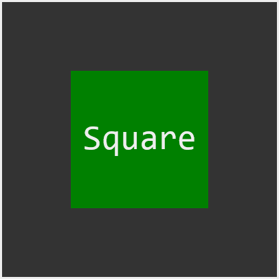

# Learning Canvas API

This project is for me to practice learning the Canvas API for an upcoming job opportunity of mine.

# Getting started

Simply run the index.html file. For livereload I run it with vscode live server.

# My sources

-   [https://developer.mozilla.org/en-US/docs/Web/API/Canvas_API](https://developer.mozilla.org/en-US/docs/Web/API/Canvas_API)
-   Following the Canvas tutorial [https://developer.mozilla.org/en-US/docs/Web/API/Canvas_API/Tutorial](https://developer.mozilla.org/en-US/docs/Web/API/Canvas_API/Tutorial)
-   [https://bucephalus.org/text/CanvasHandbook/CanvasHandbook.html#text](https://bucephalus.org/text/CanvasHandbook/CanvasHandbook.html#text)

# Thoughts (some answered with generative AI)

-   Why does text inside of canvas not render e.g \<canvas>Hello World\</canvas>
    -   The \<canvas>
        element is designed for drawing graphics with JavaScript, not displaying HTML content directly. To show text on a canvas, you need to use JavaScript and specific text rendering functions provided by the canvas API.
-   What is the default size of canvas
    -   The default size of a canvas element is 300 pixels wide and 150 pixels high. You can change this using HTML attributes or CSS properties.
-   Look into WebGL
-   Test "The \<canvas> element can be styled just like any normal image (margin, border, background…)."
-   measureText is weird [https://bucephalus.org/text/CanvasHandbook/CanvasHandbook.html#measuretexttext.width](https://bucephalus.org/text/CanvasHandbook/CanvasHandbook.html#measuretexttext.width)
-   I wonder if it would be possible for me to create a small declarative canvas API framework
